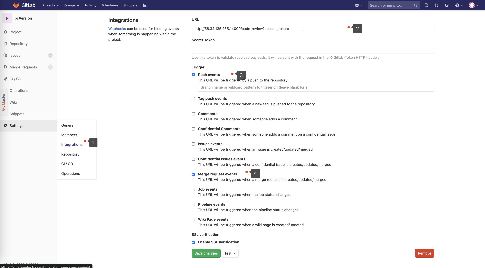
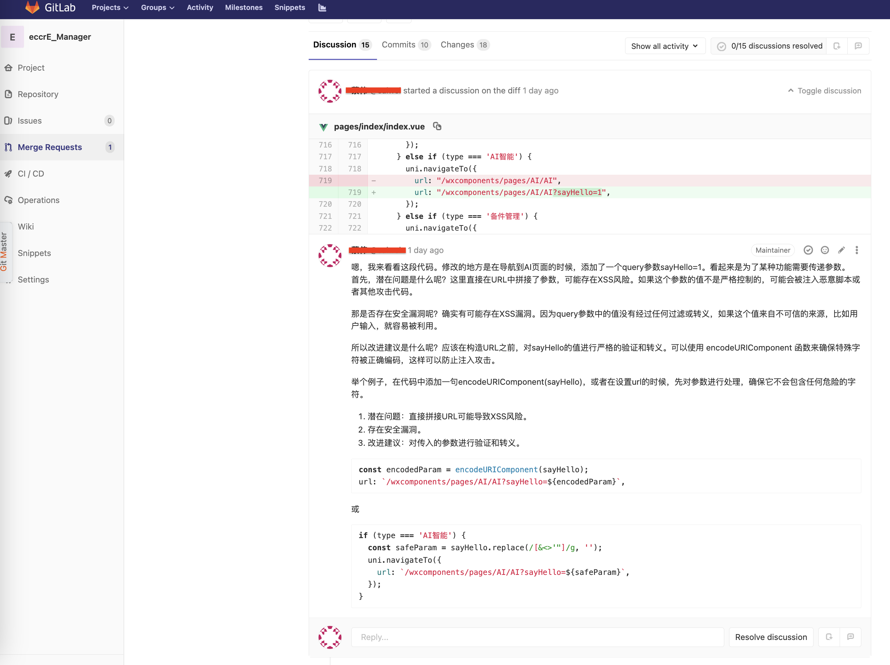

## 功能介绍
一个基于开源大模型的 Code Review 实践，类似一个代码评审助手。

在 Gitlab 中使用 deepseek 或 其他模型（ ChatGPT等） 进行 CodeReview。当你在 GitLab 上创建一个新的 Merge request 时，机器人会自动进行代码审查，审查信息将显示在 MR timeline / file changes 中。

## 特性
符合公司安全规范，所有代码数据不出内网，所有推理过程均在内网完成。
1. 开箱即用：基于 Gitlab CI的webhook，仅需url配置完成接入，自动捕获，MR触发时对 MR 进行 自动化CR，生成代码质量监测报告，自动插入discussion。
2. 数据安全：目前已经接入了公司内部部署的deepseek版本，确保代码 CR 过程仅在内网环境下完成。
3. 无调用次数限制：使用公司部署的本地化deepseek版本，没有其他成本。
4. 评论到变更行：CR 助手将结果评论到变更代码行上。
## Usage
### 运行服务

1. `npm install`
2. `npm run start`

### Gitlab配置Webhook
配置回调服务地址

Webhook URL示例:`http://xxx:4000/code-review?access_token=<access_token>`

## Configuration

1. `BASE_URL` AI模型host，默认`https://api.openai.com`,可替换通义或其他模型链接
2. `API_KEY`  [required] 模型api的key
3. `DEFAULT_MODEL` 默认`gpt3.5-turbo`,可替换通义或其他模型
4. `GITLAB_URL` 你的gitlab仓库的host
5. `TARGET_CR_FILE` 正则匹配需要`code review`的文件，默认检查.js/.jsx/.ts/.tsx结尾的文件

## 实践步骤
1. 配置Gitlab webhook, 生成access_token( setting / access_token )

2. 开发代码提交feature分支生成commit
3. 执行Gitlab Merge Request 触发评论

## Todo List

- [x] 支持open ai / deepseek 等模型切换
- [x] 支持代码变更文件按模块发送和回复评论
- [x] 并发不同项目mr请求处理的问题（暂时看起来没什么问题）
- [x] review结束添加说明语句
- [x] 添加任务列表数据库
- [x] 再次提交commit时，不做review
- [x] 完整的log日志
- [ ] 添加仓库白名单
- [x] 过长文本截断（目前deepseek单次请求上限是128000个token - 9.6w的英文单词）输入超出限制是，系统会自动启动分层，对上下文压缩
- [ ] 类似变更只对首次提供建议，后续的仅添加文本描述（同上）

- [ ] 针对上下文获取整个方法和变更项的代码片段
- [ ] 添加代码审核的进度条百分比及飞书机器人推送进度

- [ ] 仅对目标分支为主分支的代码提交时做代码审核
- [ ] 添加知识库微调（定制化企业代码规范风格，或者周期性生成批量的模块代码）
      知识库大概有几种方式
      1. 代码直接上下文
      2. RAG 
      3. AST 获取diff影响的链路

